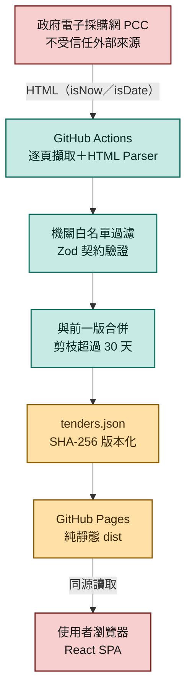
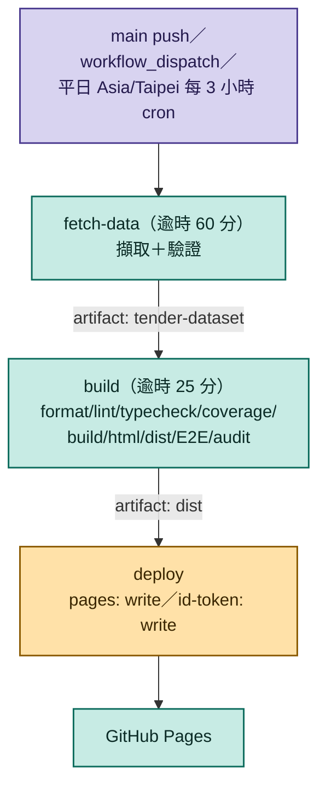

# 國防部當日公告標案儀表板

## 分享介紹

每天在政府電子採購網翻頁找國防部標案？我們把這件事自動化了。**國防部當日公告標案儀表板**每 3 小時同步一次，公告日新到舊排序，一週內動態一目了然。免登入、免安裝、不用任何 API key——純靜態網頁，資料經 SHA-256 驗證，來源標註清楚透明。無論你是投標廠商業務、採購承辦，還是政策研究者，都能快速篩選機關與時間範圍，省下人工翻頁比對的時間。本站為非官方公開資料整理，內容仍以政府電子採購網公告為準。想省時間找標案，先來看一眼。

以「方案 A」運作的純靜態 React／Vite 儀表板。GitHub Actions 不限機關逐頁擷取政府電子採購網，例行查詢用 `dateType=isNow`（當日），首次執行（無可用前一版基準）改用 `dateType=isDate` 一次回填過去 30 天（見 [ADR-002](docs/specs/001-pages-migration/adr-first-run-backfill.md)）。資料經固定來源限制、HTML parser、機關白名單過濾、Zod 契約與 SHA-256 驗證後，與前一版合併、剪枝超過 30 天的舊記錄，發布到 GitHub Pages。瀏覽器只讀取同源 `data/tenders.json`，可用機關（預設國防部）與日期範圍（當日／一週／一個月，預設一週）在本地端篩選，結果依公告日期新到舊排序；頁面另有可展開的說明面板列出完整機關白名單與同步排程。瀏覽器不會直接存取政府採購網。

本站為非官方公開資料整理，內容以政府電子採購網公告為準。不使用 Gemini 或其他生成式 AI API，也不需要任何 API key。

## 系統流程



政府電子採購網（PCC）全程視為不受信任來源；資料經固定路徑擷取、白名單過濾與契約驗證後，才與前一版合併、剪枝，發布成版本化 JSON。瀏覽器只讀取同源靜態檔，不會直接連到 PCC 或任何 API。任一環節失敗即 fail closed，保留上一版，細節見 [SDD 系統設計文件](docs/pm/index.html)。

## 本機開發

需求：Node.js 24 以上、npm。

```bash
npm ci
node --import tsx scripts/create-sample-data.ts
npm run dev
```

`public/data/tenders.json` 是 deterministic fixture 產生的開發資料；一般測試不依賴政府網站。

## 資料更新

```bash
npm run fetch:data
```

這是獨立 live smoke／資料產生指令。來源 URL 由程式固定建立，不接受 CLI 或環境變數傳入完整 URL。沒有可用前一版基準時（真的第一次執行，或前一版累積 0 筆／schema 不相容）會改用日期區間查詢一次回填過去 30 天，實測約需 20 分鐘且逐頁遞增，回填失敗時自動退回只抓當日；平常則只查當日並與前一版合併、剪枝超過 30 天的舊記錄。成功時以原子 rename 更新 JSON；逾時（含重試後）、redirect、錯誤 Content-Type、超量、拒絕比例過高、schema/hash 失敗、分頁連結跳出固定路徑，或同日新增筆數較最近 Pages 版本下降超過 50% 時，會以非零狀態停止。

GitHub Actions 只在工作目錄產生資料並包入 Pages artifact，不會自動 commit 資料回 `main`。

## 測試與品質閘門

```bash
npm run format
npm run lint
npm run typecheck
npm run test:coverage
npm run security:workflows
npm run workflow:lint
npm run security:repo
npm run security:history
npm run build
npm run validate:html
npm run security:dist
npm run test:e2e
npm audit --audit-level=high
```

也可用 `npm run validate` 執行除瀏覽器 E2E、Git history scan 與需連網 audit 之外的本機閘門。`security:history` 必須在 Git repository 中執行。E2E 會啟動 production preview，驗證 1440×1000 桌機、390×844 手機、axe、CSP、同源請求與水平溢位。

## GitHub Pages 部署

`.github/workflows/data-and-pages.yml` 在 `main` push、手動觸發，以及平日 `Asia/Taipei` 每 3 小時（`0,3,6,9,12,15,18,21` 點）執行，分三個 job：



1. `fetch-data`（逾時 60 分鐘）：只做資料擷取與驗證，把 `public/data/tenders.json` 以 artifact 交給下一個 job；首次 30 天回填可能需要約 20 分鐘，因此獨立出來，不擠壓下面的品質閘門時限。
2. `build`（逾時 25 分鐘，`needs: fetch-data`）：下載該 artifact 後執行 format、lint、strict typecheck、coverage、workflow policy、build、HTML validation、dist scan、E2E 與 audit，全部通過才把只含 `dist` 的 artifact 交出去。
3. `deploy`（`needs: build`）：只有這個 job 取得 `pages: write` 與 `id-token: write`，發布到 GitHub Pages。

Repository 的 Pages Source 必須設為 **GitHub Actions**。部署 environment 固定為 `github-pages`，建議在 GitHub 設定 environment protection rules。CI、dependency review、CodeQL 與 Dependabot 設定均位於 `.github/`；所有 Actions 均鎖定已核對的完整 commit SHA。

`build` job 的最後一道關卡 `npm audit --audit-level=high` 會在任何間接依賴被通報 high／moderate 漏洞時讓整個 job fail closed，deploy 不會執行——這是刻意設計，但也代表新漏洞一冒出來、下一次排程就會立刻卡住部署（見下方「維運事故紀錄」）。為了不必每次都靠人工發現才處理，另外兩個獨立 workflow 負責把這個關卡的維護自動化：

- `.github/workflows/dependency-audit-fix.yml`：平日／假日皆排程於每天 `Asia/Taipei` 01:00 執行 `npm audit fix`，若產生 lockfile 變更就重跑一次完整 `npm run validate`，驗證過才直接 commit／push 到 `main`；最後固定再跑一次 `npm audit --audit-level=high`，就算這次沒東西可自動修但仍有殘留漏洞，也會讓 job 失敗以通知，不悄悄放行。
- `.github/workflows/dependabot-auto-merge.yml`：偵測到 Dependabot 開出的 PR 時，用 `gh pr checks --watch --fail-fast` 明確等既有 CI、CodeQL、Dependency review 全部跑完且通過，才 squash-merge 並刪分支；不依賴 repository 的 auto-merge 設定或 branch protection（目前皆未啟用），避免「沒有 required checks 時可能不等 CI 就先合併」的邊界情況。

Project Pages 預設使用 `/<repository>/`。若使用自訂網域、使用者 Pages 或其他根路徑部署，將 repository variable `PAGES_BASE_PATH` 設為 `/`；也可設為經驗證的同源目錄路徑（例如 `/portal/`）。完整 URL、`..` 與 protocol-relative 值會在 build 時被拒絕。

### 交接給負責上傳的 AI

目前交付目錄刻意不包含 `.git`、remote 或 GitHub credential。負責上傳者必須先取得使用者確認的**既有** `OWNER/REPOSITORY` 與有效登入，不得猜測或自行建立其他 repository。遠端已有歷史時應 clone 後以功能分支／PR 合併；遠端為空時也應先建立最小 `main`，再用 PR 讓 dependency review 與 CodeQL 實際執行。

完整的安全上傳、Pages 設定、workflow 監看與 production 驗收步驟見 [GitHub 上傳與 Production 交接手冊](docs/GITHUB-UPLOAD-HANDOFF.md)。

## 執行進度與 Production 部署驗收報告

本專案已完成從 Google AI Studio 原始版本（含 Express/Gemini/API Key）至純靜態 **Level A 安全架構** 的改造，並已順利完成 GitHub 上傳、PR 安全審查、Actions 自動化部署與 Production Live 驗收。

### 1. 架構改造與安全邊界

- **資料流轉**：政府電子採購網 (PCC)，不限機關逐頁擷取（例行 `isNow` 當日／首次回填 `isDate` 過去 30 天）→ GitHub Actions 於平日 Asia/Taipei 每 3 小時定時擷取 → HTML Secure Parser & 機關白名單過濾 & Zod 契約驗證 → 與前一版合併並剪枝超過 30 天的資料，產出版本化 `data/tenders.json` (含 SHA-256) → Vite Production Build → 部署至 GitHub Pages。
- **零公開 API / 無後端**：已徹底刪除 Express、Server.ts 與 Gemini SDK；瀏覽器僅讀取同源 `data/tenders.json`，不直接發出任何對外 PCC 或 API 請求。
- **純靜態 Pages 安全**：採純 GitHub Pages 原生安全控制，不掛載 Cloudflare、Vercel、Netlify 或代理服務。

### 2. GitHub 上傳與 CI/CD 安全管線紀錄

- **目標 Repository**：[lushinshang/pcc_q](https://github.com/lushinshang/pcc_q) (Public)
- **Pull Request**：[PR #1 (feat/pages-scheme-a -> main)](https://github.com/lushinshang/pcc_q/pull/1) - head commit 之 Quality and security gates、Dependency review、CodeQL 分析（javascript-typescript／actions）均為 success 後無衝突合併；main 分支目前未啟用 branch protection，因此這些 checks 屬於 CI 通過紀錄，非 GitHub 強制的 required status checks。
- **安全檢查通過項目**：
  - **CI / Quality & Security Gates**：ESLint 0 warnings、TypeScript Strict 0 errors、Vitest 122/122 測試全過 (Coverage: Stmts 95.77%, Branches 92.28%, Functions 96.03%, Lines 96.27%)。
  - **CodeQL 分析**：`javascript-typescript` 與 `actions` 雙軌分析通過，無未處理之 High/Critical 漏洞。
  - **Dependency Review**：已啟用 Dependency Graph 並完成依賴分析，0 vulnerabilities。
  - **Git History Secret Scan**：Gitleaks v8.30.1 於 `npm run security:history`（CI 每次 push 皆執行）完成全歷史掃描，零發現 (no leaks found)；掃描涵蓋的 commit 數會隨每次 push 增加，請以該次 CI run 的實際輸出為準，不在此固定數字。

### 3. Production 部署與 Live 驗收數據

- **Production URL**：[https://lushinshang.github.io/pcc_q/](https://lushinshang.github.io/pcc_q/)
- **Deployment Run URL**：[https://github.com/lushinshang/pcc_q/actions/runs/30152099903](https://github.com/lushinshang/pcc_q/actions/runs/30152099903)
- **最新成功部署 Commit SHA**：`fe41d054006399f5a5760e2df82c2c77c7762382`（此為 Deployment Run URL 對應的 commit；main HEAD 可能領先於此，請以 `gh api repos/lushinshang/pcc_q/deployments` 查詢的最新 deployment 為準）
- **最後驗收時間**：2026-07-25 17:04 (Asia/Taipei)

#### 14 項 Live Production 實體驗收對照表

| 驗收項目                       | 驗收規範細節                                                                                                                   | Live 測試結果 | 證據 / 數據                                                    |
| :----------------------------- | :----------------------------------------------------------------------------------------------------------------------------- | :------------ | :------------------------------------------------------------- |
| **靜態資產載入**               | HTML、JS、CSS 及 `data/tenders.json` 回應 200 OK                                                                               | **通過**      | 無 HTTP 錯誤或 Mixed content                                   |
| **Base Path 正確性**           | Project Pages 資產載入路徑前綴為 `/pcc_q/`                                                                                     | **通過**      | `dist` 靜態路徑完美對齊                                        |
| **真實標案資料**               | 成功呈現 30 天滾動累積資料集（包含正確 `fetchedAt` 與 `recordCount`）                                                          | **通過**      | 累積 `recordCount: 15892` 筆，SHA-256 驗證比對一致             |
| **查詢模式驗證**               | 例行查詢 `queryMode` 為 `isNow`；首次回填為 `isDate`                                                                           | **通過**      | 正確顯示「當日公告 (isNow)」狀態                               |
| **預設篩選與網址搜尋**         | 預設機關＝國防部、日期範圍＝一週；網址包含 `?q=綜合任務` 仍安全顯示預設篩選結果                                                | **通過**      | 實測顯示「234／15892 筆」，搜尋條件正確解耦與獨立              |
| **排序**                       | 標案列表依公告日期由新到舊排序                                                                                                 | **通過**      | Playwright DOM 檢查最新公告日期排在最前                        |
| **新鮮度控管**                 | 資料在 2 小時新鮮度內顯示綠色新鮮標誌；超過 2 小時提示警示（若擷取時間為六日，顯示「週末例行暫停同步（下一版：週一 00:00）」） | **通過**      | 顯示「資料在兩小時新鮮度內」／週末正確提示「週末例行暫停同步」 |
| **同源請求限制**               | 頁面重新載入與點擊重新載入僅發出同源 `data/tenders.json` 請求                                                                  | **通過**      | 網路監聽 0 筆 `/api/tenders` 或 `web.pcc.gov.tw` 請求          |
| **外部連結安全**               | 點擊標案開啟政府採購網連結均具備 `rel="noopener noreferrer"`                                                                   | **通過**      | Playwright DOM 檢查 100% 符合                                  |
| **無障礙規範 (a11y)**          | 符合 WCAG / axe-core 規範                                                                                                      | **通過**      | axe-core 檢測 serious / critical 違規數為 0                    |
| **跨裝置響應式與無溢位**       | 桌機 1440×1000 與手機 390×844 Viewport 均零水平溢位                                                                            | **通過**      | Playwright E2E 檢測 `scrollWidth == clientWidth` 通過          |
| **CSP 安全政策**               | 依據 Content-Security-Policy meta 規則運作                                                                                     | **通過**      | Console 0 筆 CSP violation 違規警告                            |
| **Production Artifact 乾淨度** | Pages Artifact 僅含 `dist` 內容                                                                                                | **通過**      | 4 個建置檔案，無 Source Map / Fixture / `.env` / 秘密          |
| **維護手冊同步**               | 驗收結果已完整同步至 `docs/specs/001-pages-migration/runbook.md`                                                               | **通過**      | Runbook 已完成即時紀錄                                         |

### 4. 紅隊資安複查與改善紀錄（OPERATION LEDGERWATCH）

Production 上線後另做了一輪獨立紅隊視角複查，找到三項違反本專案「任何異常都該 fail closed」核心原則的具體缺口——不是臆測，都附檔案行號與可重現步驟。完整測試計畫、攻擊面地圖與逐項改善規劃（依 SDD 先定義設計變更、TDD 先寫失敗測試再實作的既有慣例）見 [紅隊資安測試計畫](docs/security/red-team-test-plan.html)。

| ID     | 缺口                                                                                                                                | 嚴重度 | 修復內容                                                                                                              | 狀態         |
| :----- | :---------------------------------------------------------------------------------------------------------------------------------- | :----- | :-------------------------------------------------------------------------------------------------------------------- | :----------- |
| RT-001 | 確認零筆判斷用樸素子字串比對，標記文字塞進 `<script>`／註解也會被誤判為合法零筆                                                     | HIGH   | 改為 `td.tb_b2` 內容標記、沒有任何標案資料列及 `#pagebanner` 顯示「共有 0 筆資料」三項證據須同時成立                  | **VERIFIED** |
| RT-002 | `fetch-tenders.ts` 的 bootstrap／fallback 核心流程完全沒有測試與 coverage，正是先前「空資料集導致回填永遠不觸發」事故未被攔下的根因 | HIGH   | 抽出可注入依賴的 `runFetchPipeline()`，CLI 與 exit code 邏輯分離；新增 FETCH-T-001～007，含「雙重失敗不寫檔」安全邊界 | **VERIFIED** |
| RT-003 | 分頁擷取跑滿 `maxPages` 上限時靜默回傳，即使最後一頁仍有下一頁連結                                                                  | MEDIUM | 迴圈跑滿上限但仍偵測到下一頁時改為拋錯 fail closed，交由既有 bootstrap fallback 自動退回例行查詢                      | **VERIFIED** |

修復由 Codex CLI 在沙箱環境（無對外網路、未觸發 GitHub Actions、未連線 PCC）依既定優先序 RT-002 → RT-001 → RT-003 完成，每項獨立 commit，全程遵循 TDD（先 Red 後 Green 再 Refactor），沒有刪除或放寬既有測試與 coverage 門檻。完成後重新執行全部本機品質閘門驗證（不僅採信執行方回報），結果一致：Vitest 122/122、Playwright E2E 8/8、ESLint／TypeScript／build／HTML validation 全過、`security:repo` 88 檔案零發現、`security:dist` 4 檔案零發現、Gitleaks 全歷史掃描零洩漏（涵蓋 commit 數會隨每次提交增加，請以最近一次執行輸出為準）、`npm audit --audit-level=high` 0 vulnerabilities；三項修復的程式碼改動亦逐一人工複核，確認邏輯與測試計畫規劃一致。

完整的 Red/Green 逐步記錄、沙箱環境例外處理（actionlint／Gitleaks 離線驗證、Playwright 權限問題等）與工程教訓，見 [runbook「最近驗證」](docs/specs/001-pages-migration/runbook.md#最近驗證)。

**尚待人工確認**：RT-002／RT-003 涉及擷取管線邏輯，需在有 GitHub 與 PCC 網路權限的真實環境手動執行一次 `data-and-pages` 的 `workflow_dispatch`，驗證真實擷取及 production deployment。這次本機工作沒有執行該步驟，也不能以 deterministic tests 取代它。

### 5. Pages 停止更新事故與自動修復機制（2026-08-07）

`data-and-pages.yml` 的排程從 2026-08-05 起連續失敗，卡在 `build` job 最後一道 `npm audit --audit-level=high` 關卡，deploy 完全沒有機會執行，Pages 因此停在舊版本超過一天未更新。

| 項目     | 內容                                                                                                                                                                                                                                                                                                                                      |
| :------- | :---------------------------------------------------------------------------------------------------------------------------------------------------------------------------------------------------------------------------------------------------------------------------------------------------------------------------------------- |
| 根因     | 四個間接依賴（`brace-expansion`、`fast-uri`、`postcss`、`undici`）新被通報 high／moderate 漏洞；Dependabot 已自動開 PR，但那些 PR 的 CI 也撞上同一道關卡而失敗，沒有自動合併，問題持續累積無人處理                                                                                                                                        |
| 修復     | `npm audit fix`（未加 `--force`，只更新 lockfile 內間接依賴版本），重跑完整 `npm run validate` 確認未破壞既有功能，`npm audit` 確認歸零後 commit（`e803132`）                                                                                                                                                                             |
| 附帶發現 | 獨立的 `ci.yml`（品質把關用，不參與部署）同一次 push 也失敗：`E2E-T-004` 因已 commit 的 `public/data/tenders.json` 樣本 `announcedDate` 寫死在最後一次更新當天，main 隔超過一週沒 push 就會被「一週」篩選篩成 0 筆而假陽性失敗；修法是在 `ci.yml` 加一步 `npm run data:sample` 於建置前重新產生今天日期的樣本（`ac89e02`），不回寫 commit |
| 預防     | 新增 `dependency-audit-fix.yml`（每天自動 `npm audit fix` 並驗證後直接 commit）與 `dependabot-auto-merge.yml`（Dependabot PR 全部 CI 過後自動合併），詳見「GitHub Pages 部署」一節（`2f25c4d`）                                                                                                                                           |

## 故障處理

- 擷取失敗：不要略過驗證或手動發布空資料；既有 Pages deployment 會保留。
- parser 因上游改版失敗：保存不含 cookie／secret 的最小 HTML fixture，先加入 regression test，再更新 parser。
- 前端重新載入失敗：已有資料時保留上一版並顯示警告；沒有有效資料時顯示明確錯誤狀態。
- 回復：回到已知良好 commit 後重新執行 workflow，不 force push、不改寫歷史。

完整操作與事故程序見 [runbook](docs/specs/001-pages-migration/runbook.md)。

## GitHub Pages 平台限制

純 GitHub Pages 無法由 repository 自訂完整 HTTP response headers。本方案的 CSP 以 `<meta http-equiv>` 落實，因此不能宣稱已設定 response-header 形式的 `Content-Security-Policy`，也不能用 meta 實作 `frame-ancestors`。HSTS、`X-Frame-Options`、`Permissions-Policy`、完整 `Referrer-Policy` response header 與 CSP reporting 同樣不在本專案控制範圍內。這是 Level A 的已知殘餘風險；未經另行授權不加入 CDN、反向代理或其他主機服務。

## 規格

權威設計與需求位於 [docs/specs/001-pages-migration](docs/specs/001-pages-migration/)，包含 requirements、Software Design Description、threat model、JSON Schema、test plan、traceability、[ADR-001（查詢模式）](docs/specs/001-pages-migration/adr-query-mode.md)、[ADR-002（首次執行日期區間回填）](docs/specs/001-pages-migration/adr-first-run-backfill.md) 與 runbook。

產品／系統分析層級的正式文件（PRD／SRS／SDD／STP）位於 [docs/pm](docs/pm/)，補齊產品層決策與正式文件結構，逐條需求與測試 ID 仍以上述 `docs/specs` 為權威來源，詳見 [docs/pm/README.md](docs/pm/README.md) 的文件關係說明。

紅隊資安測試計畫與改善規劃位於 [docs/security/red-team-test-plan.html](docs/security/red-team-test-plan.html)，見「執行進度與 Production 部署驗收報告」第 4 節。

## 目錄結構

- `src/`、`scripts/`、`tests/`、`config/`、`public/`、`docs/`：專案本體（程式碼、測試、規格文件）。
- `qa/`：E2E 測試產生的最新視覺驗證截圖（`npm run test:e2e` 會覆寫）。
- `_archive/`：與目前專案執行無關、僅供歷史參考的檔案（例如最初的 SDD/TDD/security 提案文件），不被任何 script、test 或 CI 引用。
